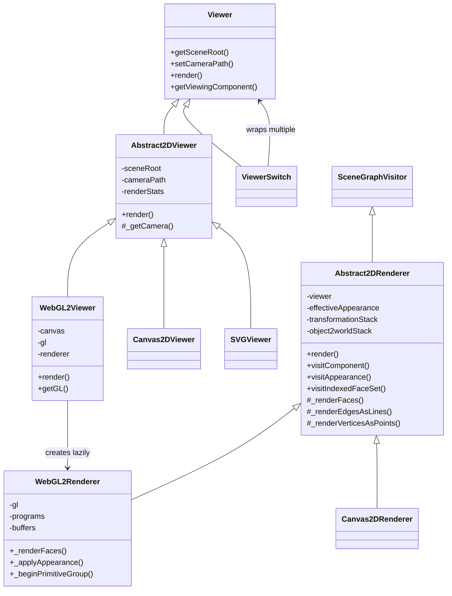
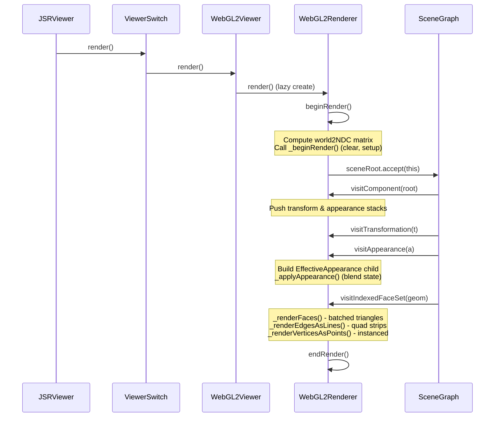

# JSRViewer & WebGL2Renderer Architecture

## Project Overview

**jsreality-2021** is a JavaScript port of the Java **jReality** 3D visualization framework. The porting follows strict guidelines in `JAVA2JS_PORTING_GUIDELINES.md`: 1:1 translation from Java, ESM named exports, single-function runtime dispatch for overloads, JSDoc with concrete JS types, and no behavioral refactoring unless explicitly permitted.

## Rendering Architecture

The rendering system follows a **visitor pattern** over a hierarchical scene graph. Here is the class hierarchy:

## Render Flow

The rendering pipeline works as follows:

## Key Architectural Details

### JSRViewer

`src/app/JSRViewer.js` is the top-level application class. It creates:

- A `ViewerSwitch` wrapping multiple backend viewers (Canvas2D, WebGL2, SVG)
- A scene graph with root, camera, content, and avatar components
- A `ToolSystem` for interaction
- A `RenderTrigger` that watches the scene graph for changes

### Abstract2DRenderer

`src/core/viewers/Abstract2DRenderer.js` handles all device-independent logic:

- Transformation stack management (world2NDC, object2world)
- `EffectiveAppearance` stack for hierarchical attribute resolution
- Scene graph traversal via the visitor pattern
- Geometry dispatch: `visitIndexedFaceSet` calls `_renderFaces`, `_renderEdgesAsLines`, `_renderVerticesAsPoints`

### WebGL2Renderer

`src/core/viewers/WebGL2Renderer.js` (~4250 lines) is the WebGL2 backend. It:

- Overrides `_renderFaces()` to batch all face polygons into a single triangulated mesh draw call (with per-face colors, normals, tex coords)
- Uses **instanced rendering** for points (quads or 3D spheres), edges (3D tubes), and discrete group tessellations
- Manages 5+ shader programs: main (WebGL1 fallback), unified lit (WebGL2), instanced point, instanced sphere, instanced tube
- Handles transparency, fog, lighting (ambient/diffuse/specular), smooth/flat shading, textures
- Overrides `visitComponent()` to detect `instancedGeometry` appearance attributes for discrete group rendering

### Key Source Files

| File | Role |
|------|------|
| `src/core/scene/Viewer.js` | Abstract `Viewer` interface |
| `src/core/viewers/Abstract2DViewer.js` | Scene root, camera path, render stats |
| `src/core/viewers/Abstract2DRenderer.js` | Device-independent scene graph traversal |
| `src/core/viewers/WebGL2Viewer.js` | Canvas, GL context, resize handling |
| `src/core/viewers/WebGL2Renderer.js` | WebGL2 drawing implementation |
| `src/core/viewers/ViewerSwitch.js` | Multi-backend viewer wrapper |
| `src/core/scene/SceneGraphVisitor.js` | Visitor pattern base class |
| `src/app/JSRViewer.js` | Application-level viewer facade |
